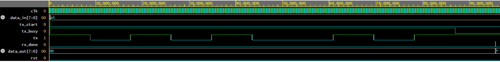

# UART Design and Verification Project

## Overview

This project implements a modular Universal Asynchronous Receiver Transmitter (UART) using synthesizable Verilog HDL. The objective of Version 1 is to develop a clean RTL implementation and verify its functionality using a Verilog testbench.

The design has been developed using a modular architecture to simplify integration, verification, and future enhancements. This project will progressively evolve into a complete Design Verification project with SystemVerilog and Universal Verification Methodology (UVM).

---

## Version 1 Status

✅ RTL Design Completed

✅ Functional Verification Completed

✅ Simulation Passed

---

## Features

- Parameterized Baud Rate Generator
- UART Transmitter (TX)
- UART Receiver (RX)
- Top-Level UART Integration
- Verilog Testbench
- Functional Simulation using Siemens QuestaSim 2025
- Waveform Verification

---

## Project Structure

```
UART_UVM_Project/

└── Version_1/
    ├── RTL/
    │   ├── baud_generator.v
    │   ├── uart_tx.v
    │   ├── uart_rx.v
    │   └── uart_top.v
    │
    ├── TB/
    │   └── uart_top_tb.v
    │
    ├── Waveforms/
    │   └── uart_top_waveform.png
    │
    ├── Documentation/
    │   ├── UART_V1_Engineering_Document.docx
    │   └── UART_V1_Engineering_Document.pdf
    │
    └── README.md
```

---

## RTL Modules

| Module | Description |
|---------|-------------|
| baud_generator.v | Generates baud tick for UART communication |
| uart_tx.v | Serializes 8-bit parallel data into UART frames |
| uart_rx.v | Receives UART serial data and reconstructs the original byte |
| uart_top.v | Integrates all UART functional modules |
| uart_top_tb.v | Functional verification testbench |

---

## Design Specifications

| Parameter | Value |
|-----------|-------|
| Language | Verilog HDL |
| Clock Frequency | 50 MHz |
| Baud Rate | 115200 bps |
| Data Bits | 8 |
| Parity | None |
| Stop Bits | 1 |

---

## Simulation

The complete UART subsystem was functionally verified using Siemens QuestaSim 2025.

The simulation confirms:

- Correct baud tick generation
- Successful UART transmission
- Correct UART reception
- Accurate reconstruction of transmitted data

Waveform:



## Tools Used

- Verilog HDL
- VS Code
- Siemens QuestaSim 2025
- EDA Playground
- Git
- GitHub

---

## Future Enhancements

The following enhancements are planned in future versions:

- RTL Optimization (Version 2)
- SystemVerilog Testbench
- Assertion-Based Verification (ABV)
- Functional Coverage
- Universal Verification Methodology (UVM)
- Regression Testing

---

## Author

**Ashritha Vasthala**

B.Tech – Electronics and Communication Engineering

KL University Hyderabad

---

## License

This project is intended for learning, research, and educational purposes.
